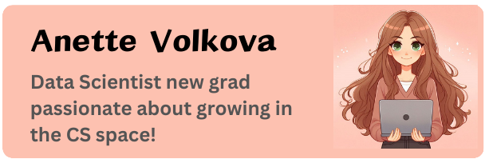

<h1 align="center">Hi ☺️, I'm Anette</h1>

  

<h3 align="center">a newgrad who is passionate about data science and learning more in the CS space! I really enjoy working in the natural languauge procession area and learning more about various LLMs. I work best in R and python, though I always like the challenge of working in a new language. My future goals for myself are becoming confident in myself within the CS space and encouraging others to learn and grow in the space as well! </h3>   

  

  
- 👾 I’m currently working on **UMS website**

- 🤓 I’m currently learning **how to webdev ;)**

- 🤝 I’m looking for help with **learning more about AI**

- 📫 How to reach me **anettevolkova6@gmail.com**

- 💃🏼 Fun fact **I do czech dancing and travel internationally for it!!!**

Look at this project which got published!!! --> [Chatbot for ORSP office](https://dl.acm.org/doi/10.1145/3686852.3686886)

<h3 align="left">Connect with me:</h3>

<h3 align="left">Languages and Tools:</h3>

            

